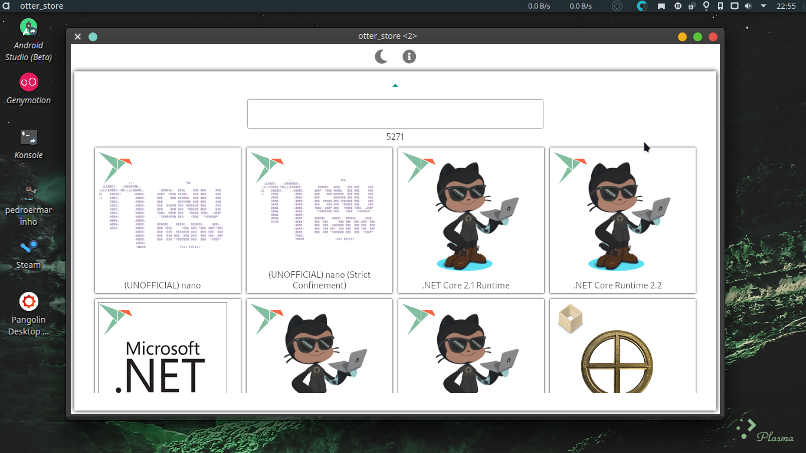
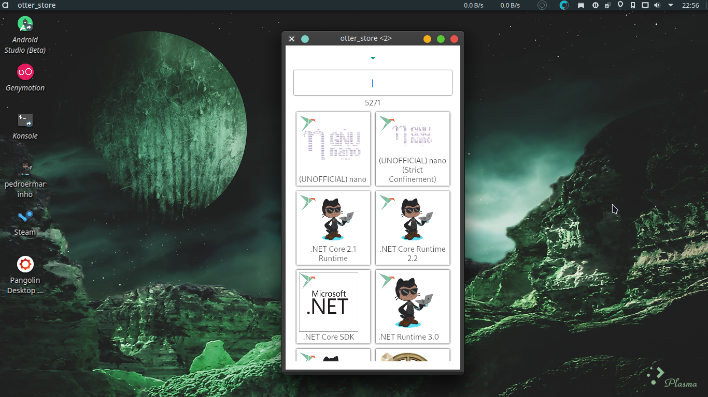
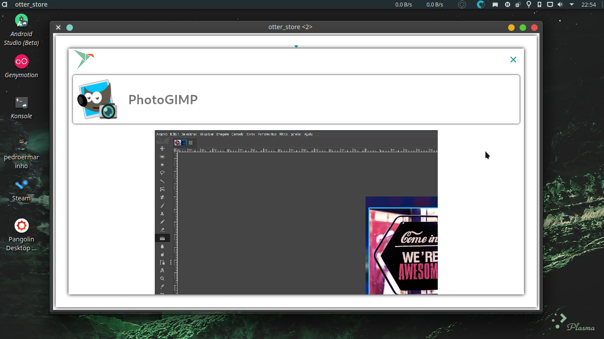
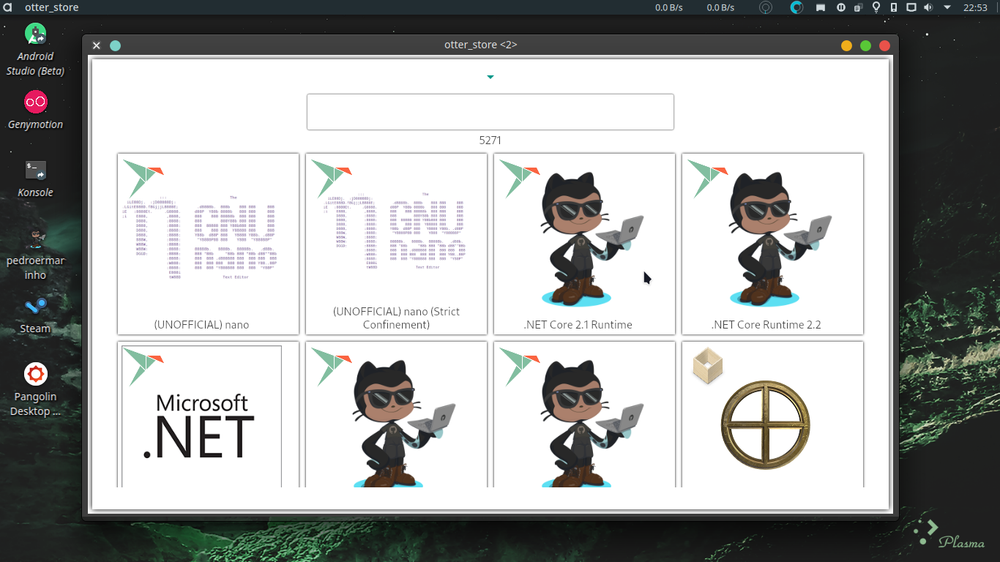
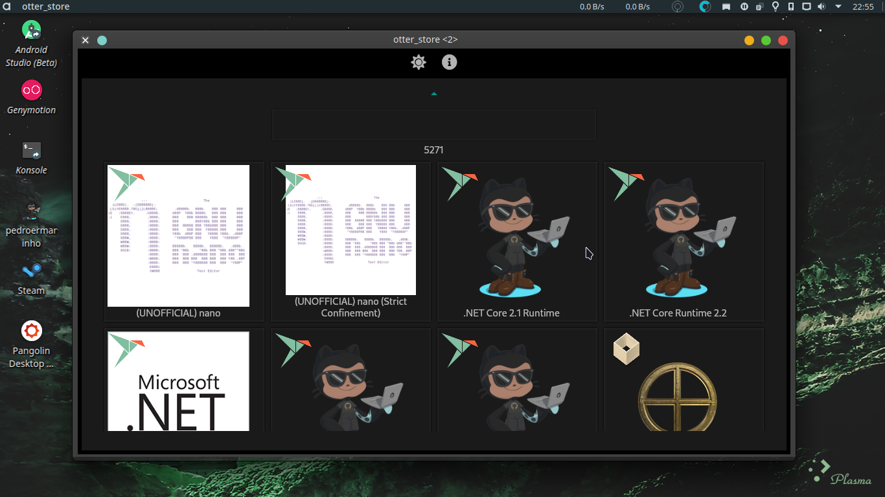
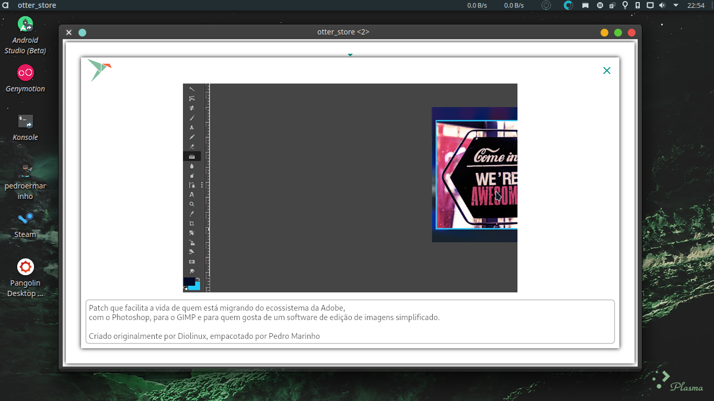
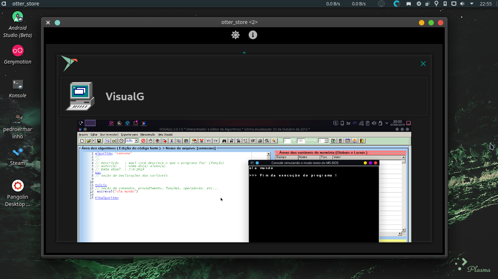
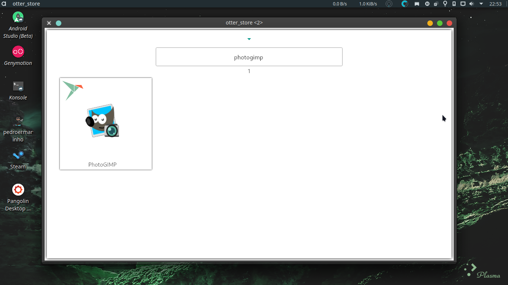

<h1 align="center">
<br/>
Welcome to Otter Store 👋

</h1>
<p>

<a href="https://github.com/pedroermarinho/otter_store#readme" target="_blank"></a>
<a href="https://github.com/pedroermarinho/otter_store/graphs/commit-activity" target="_blank"></a>
<a href="https://github.com/pedroermarinho/otter_store/blob/master/LICENSE" target="_blank"></a>
<a href="https://twitter.com/pedroermarinho" target="_blank"></a>
</p>

> Loja de aplicativos
### 🏠 [Homepage](https://github.com/pedroermarinho/otter_store#readme)
### ✨ [Demo](https://github.com/pedroermarinho/otter_store#readme)
## Install
```sh
flutter run -d linux

```


## Author
👤 **Pedro Marinho**
* Website: https://pedroermarinho.github.io/
* Twitter: [@pedroermarinho](https://twitter.com/pedroermarinho)
* GitHub: [@pedroermarinho](https://github.com/{github_username})
* LinkedIn: [@pedroermarinho](https://linkedin.com/in/{author_linkedin_username})

## 📸 Screenshot
<h1 align="center">

















</h1>

## 🤝 Contributing
Contributions, issues and feature requests are welcome!<br />Feel free to check [issues page](https://github.com/pedroermarinho/otter_store/issues). You can also take a look at the [contributing guide](https://github.com/pedroermarinho/otter_store/blob/master/CONTRIBUTING.md)
## Show your support
Give a ⭐️ if this project helped you!

## 📝 License

Copyright © 2020 [Pedro Marinho](https://github.com/pedroermarinho ).<br/>
This project is [MIT](https://github.com/pedroermarinho/otter_store/blob/master/LICENSE) licensed.

---
_This README was created with the [markdown-readme-generator](https://github.com/pedroermarinho/markdown-readme-generator)_